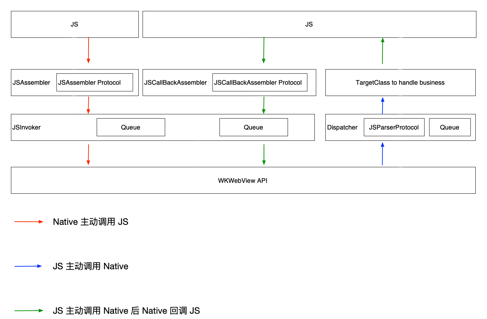

# XMWebView

[](https://travis-ci.org/xiao3333ma@gmail.com/XMWebView)
[](https://cocoapods.org/pods/XMWebView)
[](https://cocoapods.org/pods/XMWebView)
[](https://cocoapods.org/pods/XMWebView)

一个轻量级的 Hybrid 框架

#### Native -> JS

 WKWebView 调用 JS 只有一个 `evaluateJavaScript:completionHandler:` 方法，JS 调用 Native 需要两步

#### JS -> Native

1. 通过 `WKUserContentController` 的 `addScriptMessageHandler:` 方法注册一个 MessageHandler
2. JS 通过 `window.webkit.messageHandlers.XM_JS2Native.postMessage(parameters);` 来调用到 Native，该框架只是对这两个方法的封装，以更加统一的方式，来打通 Native - JS

封装之后，框架如下


#### JSAssembler

JS 组装器，用来组装 Native 调用 JS 字符串, `XMWebViewJSDefaultAssembler` 实现了 `XMWebViewJSAssemblerProtocol` 协议，提供了一个默认的组装器

```js
 XM_Native2JS({name: foo, 
               params:{
                  foo1: bar1,
                  foo2: bar2,
               }});

```

可以实现 `XMWebViewJSAssemblerProtocol` 来定义自己的组装器

#### JSInvoker 

JSInvoker 会把每一个 JS 调用封装为 `XMWebViewJSInvokeOperation` 放到队列里来执行，队列有两个 `invokJSQueueWithLoadingState` 会在 webView loading 结束之后，开始执行；`invokJSQueueIgnoreLoadingState` 则会直接执行

#### XMWebViewJSDispatcher

XMWebViewJSDispatcher 是一个派发器，派发 JS 调用 Native 的方法。

#### JSParser

`XMWebViewJSDefaultJSParser` 实现了 `XMWebViewJSParserProtocol` 协议，来解析 JS 传过来的数据，该解析器解析如下默认数据

JS 调用 Native 的数据格式如下
```js
 XM_JS2Native({name: foo, 
               params:{
                  foo1: bar1,
                  foo2: bar2,
               }});

```
Native 收到的回调数据如下

``` objective-c
message.body = @{
    name: foo
    params: @{
        foo1: bar1,
        foo2: bar2,
    }
 }
```
`XMWebViewJSDefaultJSParser` 将会解析出类名 `XMWebViewFooHandler`, 参数 `@{@"foo1": bar1,@"foo2": bar2}`。

`XMWebViewFooHandler` 是一个继承自 `XMWebViewJSDefaultHandlerOperation` 的 `operation`，这 operation 会被加入主队列中执行

#### XMWebViewJSDefaultHandlerOperation

该类为处理业务逻辑的基类，应当继承与此类来处理自己的业务逻辑，该类已经处理好各种状态机，以及 JS 传递过来的参数的绑定，子类只需实现 `-handleBusiness:` 来处理自己的业务即可，当处理完成之后，调用 `-callJSBackWithParams:` 来回调给 JS

#### JSCallBackAssembler

`XMWebViewJSDefaultCallBackAssembler` 实现了 `XMWebViewJSCallBackAssemblerProtocol` 协议来构造一个 NSString，从而执行 JS。 用户可以实现自己的构造器来定义回调给 JS 的格式


webView 启动时 Native 主动注入一段 JS，来让 JS 调用 Native，Native 回调时会调用 `window.XM_NativeCallBackNameMap.funcName(params)` 来触发 MessageChannel 的 port1 发送消息，在 promise 中的 port2 的 onmessage 会被调用，然后执行 resolve 

``` js
var XM_JS2Native_MessageQueue = {};
function XM_JS2Native(parameters) {
    var channel = new MessageChannel(); // 创建一个 MessageChannel
    if(!window.XM_NativeCallBackNameMap) {
        window.XM_NativeCallBackNameMap = {};
    }
    var id = parameters.name + "_" + Math.random();
    parameters.id = id;
    XM_JS2Native_MessageQueue[id] = channel;

    window.XM_NativeCallBackNameMap[parameters.name] = function(nativeValue) {
        if (nativeValue.id && XM_JS2Native_MessageQueue[nativeValue.id]) {
            XM_JS2Native_MessageQueue[nativeValue.id].port1.postMessage(nativeValue);
            delete XM_JS2Native_MessageQueue[nativeValue.id];
        }
    };
    window.webkit.messageHandlers.XM_JS2Native.postMessage(parameters);
    return new Promise(function(resolve, reject) {
        channel.port2.onmessage = function(e) {
            var data = e.data;
            resolve(data);
            channel = null;
        };
    });
}
```

### 使用方式

JS

``` js
XM_JS2Native({name: test, params:{foo1:bar1, foo2:bar2}}).then(nativeValue => {
    // 当 Native 回调的时候，这里会被出发
})
```

Native

XMWebViewTestHandler.h
``` Objective-C
@interface XMWebViewTestHandler : XMWebViewJSDefaultHandlerOperation

@end
```

XMWebViewTestHandler.m

``` Objective-C
#import "XMWebViewTestHandler.h"

@implementation XMWebViewTestHandler

- (void)handleBusiness {
    NSLog(@"param: %@", self.parameters);
    [self callJSBackWithParams:@{@"arg1": @"foo", @"arg2": @"bar"}];
}

@end
```

如有疑问，欢迎 issue